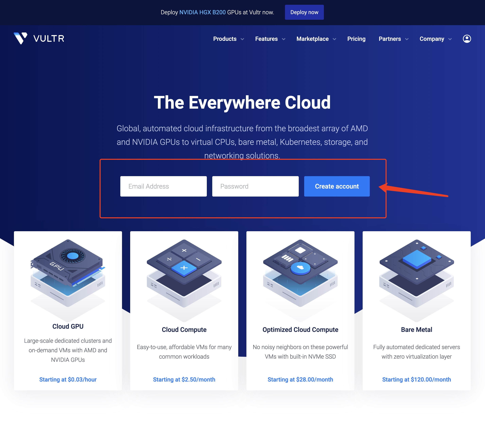
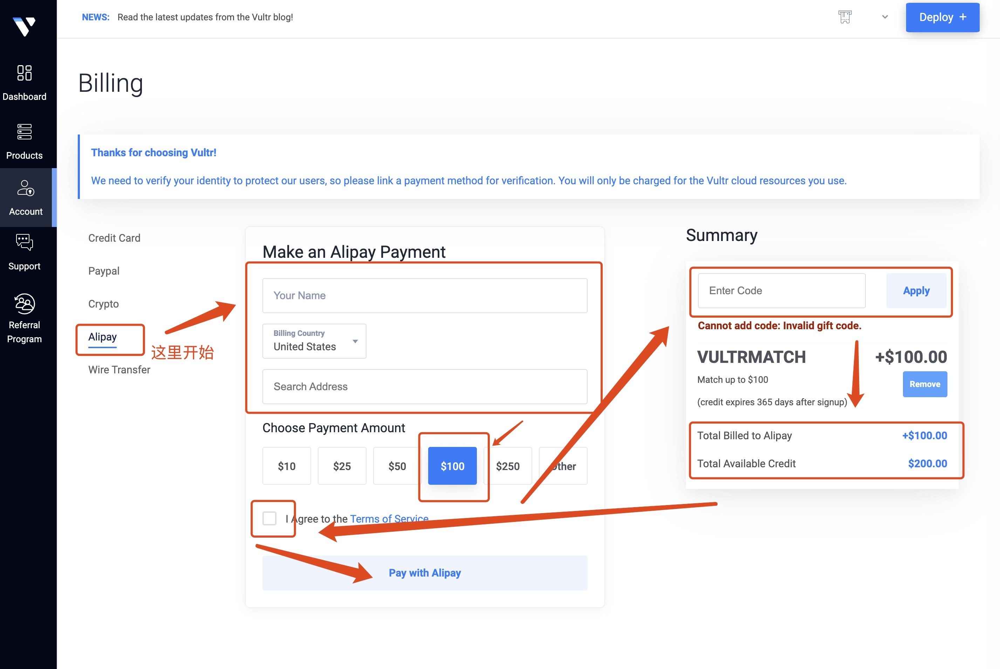
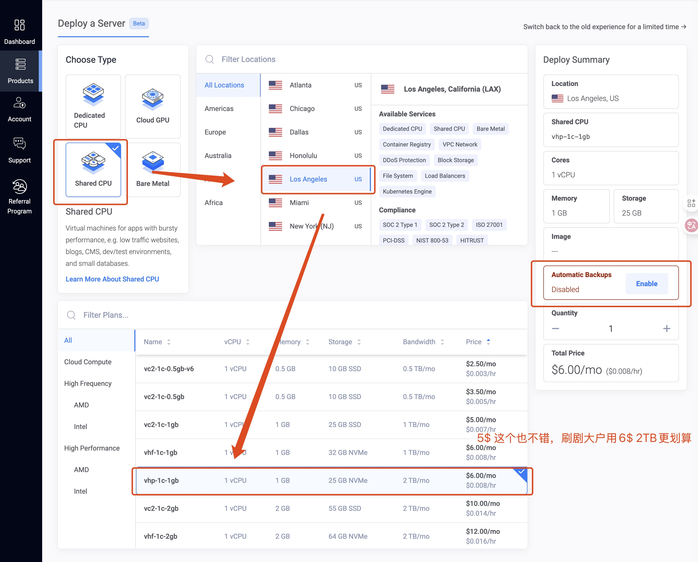
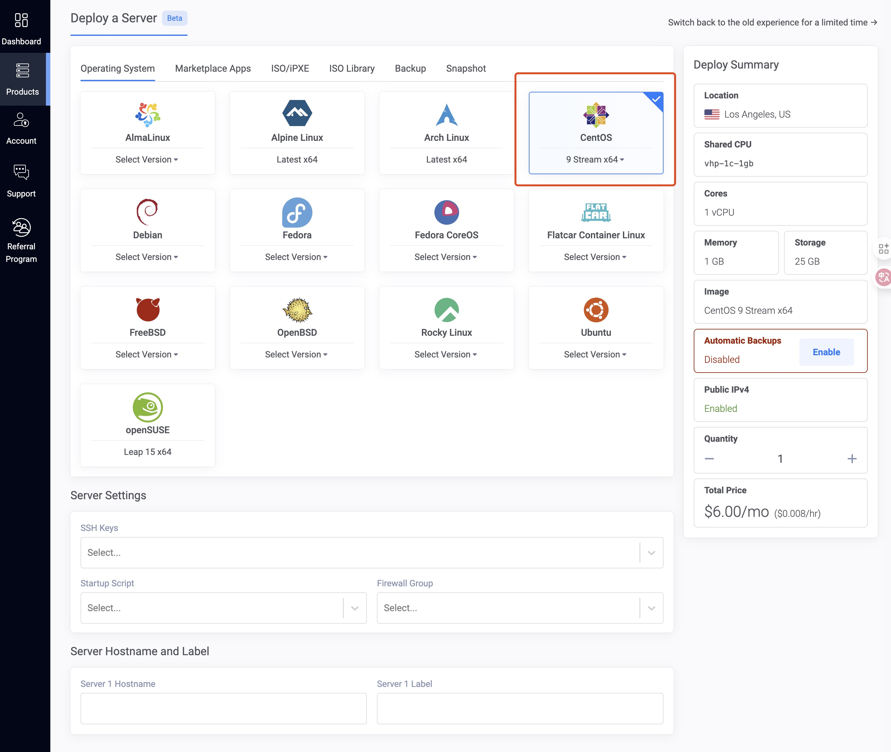

# vpn-2025
**编写不易，请务必使用「我的邀请链接」https://www.vultr.com/?ref=9776268**

本指南旨在帮助你在一台全新的 CentOS 9 服务器上，搭建一套 Shadowsocks + v2ray-plugin 代理服务。该架构通过 WebSocket (WS) 协议进行数据传输，并使用 Nginx 进行反向代理和 TLS 加密，最终将代理流量完美伪装成标准的 HTTPS 网站流量，以实现最佳的隐蔽性和稳定性。

#### **架构概览**

*   **客户端** <=> **互联网** <=> **Nginx (443端口, TLS)** <=> **v2ray-plugin (本机14314端口)** <=> **Shadowsocks-libev (本机8388端口)**

---

### **第 0 步：准备工作**

在开始之前，请确保你拥有：

1.  一台安装了 CentOS 9 操作系统的服务器。（注册购买流程参考下面）
2.  一个已经注册的域名，建议使用namesilo购买。 (购买流程也参考下面)
3.  将你的域名通过 A 记录（ipv4）解析到你服务器的公网 IP 地址。请务必提前完成，因为 DNS 解析需要一些时间生效。

#### 0.1 服务器选择与购买

我这里选择的是vultr.com，是老牌的云服务器厂商了，支付方式支持支付宝十分方便

**编写不易，请务必使用「我的邀请链接」https://www.vultr.com/?ref=9776268**

进入页面后直接用邮箱注册即可，可以选择gmail、outlook等，163邮箱和qq邮箱没测试过



注册成功后会直接跳转billing付款页面，选择Alipay（支付宝）

重点：右侧一定输入官方的首存双倍活动优惠码 **VULTRMATCH** 最高冲100USD送100USD，有效期一年



充值成功后，账户里应有 **200USD** 了

#### 0.2 部署服务器

点击右上角 **Deploy+** ，页面跳转 **Deploy a Server** 首页，选择服务器；

如果是自己用的话，选择

- Type：选择**Shared CPU**，多个虚拟服务器共享一个物理 CPU 核心的计算能力。因为你的 VPN 服务在绝大多数时间里 CPU 占用率接近于 0，所以共享 CPU 完全足够。
- vCPU：选择**1 vCPU**，足以应对上百个并发连接的 TLS 加解密和数据转发。对于个人使用，即使你同时在电脑、手机上看视频，一个 vCPU 的负载也远未达到瓶颈。
- Memory：选择**1G**，这是**最理想、最推荐**的选择。它为操作系统提供了充足的运行空间，也为网络连接缓冲区和系统缓存留下了足够的余地，可以确保系统长期稳定流畅运行，即使未来想在服务器上再跑一些轻量级的小工具（如个人博客、监控探针）也毫无压力（2G纯属浪费）。
- Storage：选择**25GB**即可，CentOS 9 系统安装完毕占用约 2G，加上所有软件和服务，总共不会超过 5G。

- 记得取消**Automatic Backups**，原因你懂的，完全用不上

地区选择建议：如果目的是顺畅使用满血chatgpt、claude等LLM线上服务，那选择**美国**节点没毛病（地区洛杉矶更好点，物理距离算最近的了）；如果只是为了刷ins、x等app，选择**新加坡**节点，个人测试下来相对稳定（主要是手机端的chatgpt在sg节点也是可用的，不知道是不是满血）；

最后你的配置选下来应该是这个样子：


点击右下角**Configure**进入下一步的配置，这里没什么选的，选一下操作系统 **CentOS 9 Stream x64**



最后点击 **Deploy** 等待部署就可以啦

#### 0.3 域名购买与DNS配置

如果不嫌麻烦的话，可以跳过这一步，但是你的流量没有伪装很大概率会被GFW识别并将ip拉入黑名单，若不幸被拉黑后，需要重新部署一遍，当然如果你选择使用域名和 v2ray-plugin代理的话，就会省很多的麻烦了；

域名的购买我这里就不赘述图片了，基本上和服务器购买差不多，也支持Alipay（支付宝），随便买一个大概首年十几块；

下面是文字版的购买指南和DNS配置指南：

1. **访问 NameSilo 官网**：[https://www.namesilo.com](https://www.google.com/url?sa=E&q=https%3A%2F%2Fwww.namesilo.com)
2. **搜索域名**：在首页的搜索框中，输入你想要的域名（例如 my-awesome-site.com），然后点击 "Search"。
3. **选择并添加**：如果域名可用，点击旁边的 "Add to Cart"（添加到购物车）。NameSilo 默认会免费提供 WHOIS 隐私保护，保持勾选即可。
4. **结算**：点击页面右上角的购物车图标，进入结算页面。如果你是新用户，需要注册一个账户。
5. **完成支付**：按照提示选择支付方式（支持支付宝、信用卡等）并完成支付。

购买成功后，你可以在 "Domain Manager"（域名管理器）中看到你刚刚购买的域名。

现在，我们要告诉 NameSilo，当有人访问你的域名时，应该去 Vultr 服务器的那个 IP 地址。

1. **返回 NameSilo**：登录你的 NameSilo 账户，进入 "Domain Manager"（域名管理器）。
2. **选择域名**：找到你想要设置的域名，点击域名右侧的**蓝色小地球图标 (Manage DNS)**。
3. **修改 DNS 记录**：你会看到一些已有的 DNS 记录模板，可以先将它们全部删除，或者直接修改。我们需要添加两条最基本的记录：
   - **记录一 (主域名)**：让 yourdomain.com 指向服务器。
     - **HOSTNAME (主机名)**: 留空或者输入 @
     - **TYPE (类型)**: A
     - **ADDRESS / VALUE (地址/值)**: 粘贴你刚刚从 Vultr 复制的服务器 **IP 地址**
     - **TTL**: 保持默认 (例如 3600)
   - **记录二 (www 子域名)**：让 www.yourdomain.com 也指向同一个服务器。
     - **HOSTNAME (主机名)**: www
     - **TYPE (类型)**: CNAME
     - **ADDRESS / VALUE (地址/值)**: 输入 @ 或者你的主域名（例如 my-awesome-site.com）
     - **TTL**: 保持默认 (例如 3600)
4. **提交保存**：添加/修改完记录后，点击页面下方的 "Submit" 按钮保存。

DNS 设置需要时间在全球范围内生效，这个过程叫做 **DNS 传播**。

1. **耐心等待**：通常几分钟到半小时内就会生效，但理论上最长可能需要 24-48 小时。
2. **如何验证**：
   - **Ping 命令**：在你的电脑上打开命令行工具（Windows 的 CMD 或 PowerShell，macOS 的终端），输入 ping yourdomain.com (换成你自己的域名)。如果返回的 IP 地址是你 Vultr 服务器的 IP，那就说明解析成功了！
   - **在线工具**：访问 [whatsmydns.net](https://www.google.com/url?sa=E&q=https%3A%2F%2Fwhatsmydns.net%2F)，输入你的域名，选择 "A" 记录进行查询。你可以看到全球各地的 DNS 服务器是否已经更新了你的记录。

---

### **第 1 步：系统初始化与环境准备**

1. **更新系统**

   ```bash
   sudo dnf update -y
   ```

2. **安装常用工具**

   ```bash
   sudo dnf install -y wget curl nano unzip socat
   ```

3. **关闭 SELinux**
   SELinux 可能会干扰 Nginx 和后端服务的通信，为避免复杂的策略配置，建议将其关闭。

   ```bash
   # 临时关闭
   sudo setenforce 0
   # 永久关闭
   sudo nano /etc/selinux/config
   ```

   找到 `SELINUX=` 这一行，修改为：

   ```
   SELINUX=disabled
   ```

   保存并退出。

---

### **第 2 步：配置防火墙**

CentOS 9 默认使用 `firewalld` 作为防火墙。我们需要放行 HTTP (80) 和 HTTPS (443) 端口。80 端口用于申请 SSL 证书，443 端口用于最终的代理服务。

```bash
sudo firewall-cmd --add-service=http --permanent
sudo firewall-cmd --add-service=https-permanent
sudo firewall-cmd --reload
```

---

### **第 3 步：安装 Nginx 并申请 SSL 证书**

1. **安装 Nginx**

   ```bash
   sudo dnf install -y nginx
   ```

2. **启动 Nginx 并设置开机自启**

   ```bash
   sudo systemctl enable --now nginx
   ```

3. **安装 Certbot (用于申请 Let's Encrypt 免费证书)**
   我们使用 `snap` 来安装最新版的 Certbot。

   ```bash
   # 安装 snapd
   sudo dnf install -y epel-release
   sudo dnf install -y snapd
   sudo systemctl enable --now snapd.socket
   sudo ln -s /var/lib/snapd/snap /snap
   
   # 确保 snapd 核心已更新
   sudo snap install core
   sudo snap refresh core
   
   # 安装 Certbot
   sudo snap install --classic certbot
   sudo ln -s /snap/bin/certbot /usr/bin/certbot
   ```

4. **获取 SSL 证书**
   运行以下命令，将 `your.domain.com` 替换为你的真实域名。

   ```bash
   sudo certbot certonly --nginx -d your.domain.com
   ```

   根据提示输入你的邮箱，同意服务条款。如果成功，证书和密钥将被保存在 `/etc/letsencrypt/live/your.domain.com/` 目录下。

---

### **第 4 步：安装 Shadowsocks-libev 和 v2ray-plugin**

我们将从 GitHub 下载预编译的二进制文件，这是最简单快捷的方式。

1. **创建安装目录**

   ```bash
   mkdir ~/install-temp
   cd ~/install-temp
   ```

2. **下载并安装 Shadowsocks-libev**
   访问 [Shadowsocks-libev Releases](https://github.com/shadowsocks/shadowsocks-libev/releases) 页面，找到最新的稳定版本，复制 `x86_64-unknown-linux-gnu` 压缩包的链接。

   ```bash
   # 注意：请替换为最新的版本链接
   wget https://github.com/shadowsocks/shadowsocks-libev/releases/download/v3.3.5/shadowsocks-libev-3.3.5.x86_64-unknown-linux-gnu.tar.xz
   tar -xf shadowsocks-libev-*.tar.xz
   sudo cp ss-server /usr/local/bin
   ```

3. **下载并安装 v2ray-plugin**
   访问 [v2ray-plugin Releases](https://github.com/shadowsocks/v2ray-plugin/releases) 页面，找到最新的稳定版本，复制 `linux-amd64` 压缩包的链接。

   ```bash
   # 注意：请替换为最新的版本链接
   wget https://github.com/shadowsocks/v2ray-plugin/releases/download/v1.3.2/v2ray-plugin-linux-amd64-v1.3.2.tar.gz
   tar -zxf v2ray-plugin-*.tar.gz
   sudo cp v2ray-plugin_linux_amd64 /usr/local/bin/v2ray-plugin
   ```

4. **赋予执行权限并清理**

   ```bash
   sudo chmod +x /usr/local/bin/ss-server
   sudo chmod +x /usr/local/bin/v2ray-plugin
   cd ~
   rm -rf ~/install-temp
   ```

---

### **第 5 步：配置后端服务 (核心步骤)**

我们将 `v2ray-plugin` 和 `shadowsocks-libev` 作为两个独立的服务运行，以实现最佳的稳定性和清晰的架构。

#### **5.1 创建 v2ray-plugin 服务**

此服务负责监听来自 Nginx 的流量，并将其转发给 Shadowsocks。

1. **创建 systemd 服务文件**：

   ```bash
   sudo nano /etc/systemd/system/v2ray-plugin.service
   ```

2. **粘贴以下内容**：
   将 `/your-secret-path` 替换为你自己的私密路径，例如 `/my-super-secret-websocket-path`。**这个路径必须与后续 Nginx 配置中的路径完全一致**。

   ```ini
   [Unit]
   Description=V2Ray-Plugin Server
   After=network.target
   
   [Service]
   Type=simple
   User=nobody
   Group=nobody
   ExecStart=/usr/local/bin/v2ray-plugin \
       -server \
       -localAddr 127.0.0.1 \
       -localPort 12345 \ 
       -remoteAddr 127.0.0.1 \
       -remotePort 8388 \
       -path /your-secret-path \
       -loglevel warning
   Restart=on-failure
   
   [Install]
   WantedBy=multi-user.target
   ```

#### **5.2 修改 shadowsocks-libev 服务**

此服务只负责处理来自 `v2ray-plugin` 的数据。

1. **创建原始服务文件（如果不存在）**：

   ```bash
   sudo nano /etc/systemd/system/shadowsocks-libev.service
   ```

   粘贴以下内容：

   ```ini
   [Unit]
   Description=Shadowsocks-libev Server
   After=network.target
   
   [Service]
   ExecStart=/usr/local/bin/ss-server
   Restart=on-failure
   
   [Install]
   WantedBy=multi-user.target
   ```

2. **使用 `override.conf` 配置启动参数**：
   这是管理 systemd 服务的最佳实践。运行：

   ```bash
   sudo systemctl edit shadowsocks-libev.service
   ```

   在打开的空文件中，粘贴以下内容。将 `YourPassword` 替换为一个强大的密码。

   ```ini
   [Service]
   ExecStart=
   ExecStart=/usr/local/bin/ss-server -s 127.0.0.1 -p 8388 -m chacha20-ietf-poly1305 -k "YourPassword"
   ```

#### **5.3 启动并验证后端服务**

```bash
# 重载 systemd 配置
sudo systemctl daemon-reload

# 启动并设置开机自启
sudo systemctl enable --now v2ray-plugin.service
sudo systemctl enable --now shadowsocks-libev.service

# 验证服务是否在监听
sudo netstat -tlpn
```

在输出中，你**必须**能看到：

*   一个 `v2ray-plugin` 进程正在监听 `127.0.0.1:14314`。
*   一个 `ss-server` 进程正在监听 `127.0.0.1:8388`。

如果端口没有被监听，请使用 `sudo journalctl -u v2ray-plugin -f` 和 `sudo journalctl -u shadowsocks-libev -f` 查看日志排错。

---

### **第 6 步：配置 Nginx**

Nginx 是我们的门户，负责处理 TLS 并将 WebSocket 流量转发给 `v2ray-plugin`。

1. **编辑 Nginx 配置文件**

   ```bash
   sudo nano /etc/nginx/nginx.conf
   ```

   找到 `http` 大括号内的 `include /etc/nginx/conf.d/*.conf;` 这一行，确保它没有被注释。

2. **创建你的网站配置文件**

   ```bash
   sudo nano /etc/nginx/conf.d/proxy.conf
   ```

3. **粘贴以下完整配置**
   请务必将 `your.domain.com` 和 `/your-secret-path` 替换为你自己的域名和路径。

   ```nginx
   # HTTP server: Redirect all traffic to HTTPS
   server {
       listen 80;
       listen [::]:80;
       server_name your.domain.com;
   
       # Allow Let's Encrypt renewal
       location /.well-known/acme-challenge/ {
           root /var/www/html;
       }
   
       # Redirect all other traffic
       location / {
           return 301 https://$host$request_uri;
       }
   }
   
   # HTTPS server: Handle WebSocket proxy and serve a camouflage site
   server {
       listen 443 ssl http2;
       listen [::]:443 ssl http2;
       server_name your.domain.com;
   
       # SSL Certificate settings
       ssl_certificate /etc/letsencrypt/live/your.domain.com/fullchain.pem;
       ssl_certificate_key /etc/letsencrypt/live/your.domain.com/privkey.pem;
       ssl_protocols TLSv1.2 TLSv1.3;
       ssl_ciphers 'TLS_AES_128_GCM_SHA256:TLS_AES_256_GCM_SHA384:TLS_CHACHA20_POLY1305_SHA256:ECDHE-RSA-AES128-GCM-SHA256:ECDHE-RSA-AES256-GCM-SHA384';
   
       # WebSocket proxy location
       location /your-secret-path { # 必须与 v2ray-plugin 服务中的路径一致
           if ($http_upgrade != "websocket") {
               return 404; # 只允许 WebSocket 连接
           }
           proxy_pass http://127.0.0.1:14314; # 转发到 v2ray-plugin
           proxy_redirect off;
           proxy_http_version 1.1;
           proxy_set_header Upgrade $http_upgrade;
           proxy_set_header Connection "upgrade";
           proxy_set_header Host $host;
           proxy_set_header X-Real-IP $remote_addr;
           proxy_set_header X-Forwarded-For $proxy_add_x_forwarded_for;
       }
   
       # Camouflage website (optional but recommended)
       location / {
           root /usr/share/nginx/html; # Nginx 默认欢迎页
           index index.html index.htm;
       }
   }
   ```

4. **测试并重载 Nginx 配置**

   ```bash
   sudo nginx -t
   # 如果显示 "syntax is ok" 和 "test is successful"，则重载
   sudo systemctl reload nginx
   ```

---

### **第 7 步：客户端配置**

现在，你可以在你的客户端（如 V2RayN, ShadowsocksX-NG, Outline 等）上进行配置了。

* **服务器地址 (Address)**: `your.domain.com`

* **端口 (Port)**: `443`

* **密码 (Password)**: `YourPassword` （你在第 5.2 步设置的密码）

* **加密方法 (Encryption)**: `chacha20-ietf-poly1305`

* **插件 (Plugin)**: `v2ray-plugin`

* **插件选项 (Plugin Options)**:

  ```
  tls;
  host=your.domain.com;
  path=/your-secret-path
  ```

  *   `tls`: 启用 TLS。

  *   `host`: 必须是你的域名，用于 TLS SNI。

  *   `path`: 必须与服务器端配置的路径完全一致。

---

### **第 8 步：维护**

*   **证书续期**：Certbot 会自动处理证书续期。你可以通过 `sudo certbot renew --dry-run` 命令来测试续期是否正常工作。
*   **查看日志**：如果遇到问题，Nginx 和后端服务的日志是你的好朋友。
    *   Nginx 错误日志: `sudo tail -f /var/log/nginx/error.log`
    *   v2ray-plugin 日志: `sudo journalctl -u v2ray-plugin.service -f`
    *   Shadowsocks 日志: `sudo journalctl -u shadowsocks-libev.service -f`
